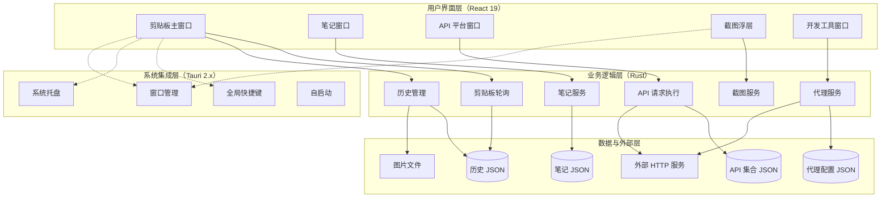

<div align="center">

# 📋 Easy-Copy（轻松剪贴板）

**一款运行在后台的剪贴板管理工具，基于 Tauri v2 + React 19 + TypeScript 构建。**
**静默记录你复制过的每一条内容，全局快捷键随时唤起、搜索、复用。**

[](./LICENSE)
[](https://tauri.app)
[](https://react.dev)
[](https://www.typescriptlang.org)
[](#)
[](./package.json)
[](#-贡献指南)

</div>


> *上图为 Easy-Copy 主界面截图，实际效果以本地运行为准。*

---

## ✨ 项目简介

Easy-Copy 是一款**跨平台桌面剪贴板增强工具**，在后台静默运行，自动捕获你复制过的所有内容（文字、图片、文件），并通过全局快捷键随时唤起、搜索、复用。

除剪贴板主功能外，Easy-Copy 还内置了 **笔记、API 平台、截图、开发工具** 四大独立模块，覆盖日常开发与办公的高频需求，开箱即用。

### 核心亮点

- 🖥️ **真正的后台运行** —— 关闭主窗口后仍在系统托盘静默监听
- ⚡ **极速唤起** —— 全局快捷键瞬间弹出主窗口，无需鼠标
- 🔍 **毫秒级搜索** —— 即时模糊匹配，关键字高亮
- 🎨 **精致界面** —— 东京之夜主题，全 SVG 矢量图标
- 📦 **极小体积** —— Rust 后端 + WebView，安装包比 Electron 版本小约 40%
- 🔒 **完全本地** —— 所有数据存储在本地，不上传任何云端

---

## 📑 目录

- [✨ 项目简介](#-项目简介)
- [🚀 功能特性](#-功能特性)
  - [📋 剪贴板（主窗口）](#-剪贴板主窗口)
  - [📝 笔记（独立窗口）](#-笔记独立窗口--ctrlshiftn)
  - [🔌 API 平台（独立窗口）](#-api-平台独立窗口--ctrlshiftu)
  - [📷 截图（全屏浮层）](#-截图独立全屏浮层--ctrlshifts)
  - [🛠️ 开发工具（独立窗口）](#-开发工具独立窗口--ctrlshiftt)
- [🛠️ 技术栈](#-技术栈)
- [🏗️ 架构概览](#-架构概览)
- [📂 项目结构](#-项目结构)
- [🚀 快速开始](#-快速开始)
- [💻 开发与构建](#-开发与构建)
- [🎯 五大模块速览](#-五大模块速览)
- [⌨️ 键盘快捷键](#-键盘快捷键)
- [💾 数据存储位置](#-数据存储位置)
- [❓ 常见问题](#-常见问题)
- [🗺️ 路线图](#-路线图)
- [🤝 贡献指南](#-贡献指南)
- [🙏 致谢](#-致谢)
- [📄 许可证](#-许可证)

---

## 🚀 功能特性

### 📋 剪贴板（主窗口）

| 类别 | 特性 |
|------|------|
| **后台监听** | 守护线程每 500 毫秒（可调）轮询系统剪贴板，自动捕获文字、图片、多文件 |
| **全局快捷键** | `Ctrl+Shift+V` 随时唤起/隐藏主窗口。注册失败时自动回退到托盘，**不会崩溃** |
| **即时搜索** | 大小写不敏感；覆盖内容与标签；命中关键字高亮显示 |
| **键盘导航** | `↑` / `↓` 选择、`Enter` 复制、`Esc` 隐藏，全程无需鼠标 |
| **系统托盘** | 左键单击切换主窗口，右键菜单快速访问各模块 |
| **图片预览** | 双击图片进入全屏查看器，支持滚轮缩放、拖动平移、双击重置 |
| **文本预览** | 内置代码高亮查看器（JSON / SQL / Markdown / 20 余种语言），超长文本自动降级为纯文本 |
| **重复检测** | 相同内容自动合并到顶部，保留收藏与标签，不产生重复条目 |
| **撤销删除** | 删除后弹出 3 秒「撤销」提示，误删可恢复 |
| **加入收藏** | 重要条目打星标，置顶显示并按时间排序 |
| **自定义标签** | 为任意条目添加彩色标签；支持自动补全、按标签搜索 |
| **日期分组** | 按「今天 / 昨天 / 本周 / 具体日期」自动分组，吸顶表头 |
| **多文件展示** | 多文件内容分行展示；可执行文件（`.exe`、`.bat`、`.sh`、`.py` 等）二次确认后打开 |
| **链接识别** | 文本中的 URL 自动识别，`Ctrl+点击` 在系统默认浏览器中打开 |
| **暗色 / 亮色 / 跟随系统** | 三档主题切换，自动模式实时跟随操作系统偏好 |
| **东京之夜配色** | 全 SVG 矢量图标，深色 / 亮色双套精心调色 |
| **隐身模式** | 一键暂停剪贴板录制（适合录屏、输密码时使用） |
| **设置面板** | 集中配置历史上限、轮询间隔、快捷键、存储路径、导入导出 |
| **开机自启** | 通过 `tauri-plugin-autostart` 实现，可选启用 |
| **导入 / 导出** | 一键导出全部历史为 JSON 文件，方便备份或迁移 |
| **窗口位置记忆** | 下次启动自动恢复窗口位置与大小（含边界值校验） |
| **数据统计** | 底部实时显示条目数量与占用磁盘空间 |

### 📝 笔记（独立窗口 · `Ctrl+Shift+N`）

- **Markdown 实时编辑**，支持 GFM（表格、任务列表、删除线等）
- **三视图切换** —— 编辑 / 分屏 / 预览
- **代码块语法高亮**（与主窗口同款查看器）
- **分类管理** —— 一级分类侧边栏，右键重命名/删除
- **标签系统** —— `#标签` 语法可在搜索框直接过滤
- **钉选置顶** —— 重要笔记永久置顶
- **从剪贴板一键转笔记** —— 文字 / 图片 / 多文件全部支持，图片内嵌为 Markdown `data:` 链接
- **自动保存** —— 400 毫秒防抖写入，标题栏显示「保存中 / 已保存」状态
- **「在浏览器中打开」** —— 渲染为独立 HTML 文档在系统浏览器中查看（自动适配深色模式）
- **Markdown 工具栏** —— 粗体 / 斜体 / 代码 / 标题 / 列表 / 引用 / 链接 / 代码块一键插入
- **键盘快捷键** —— `Ctrl+B` 加粗、`Ctrl+I` 斜体、`Ctrl+N` 新建笔记、`Ctrl+F` 聚焦搜索
- **搜索语法** —— 输入 `#标签` 过滤标签；空白分隔支持多关键字 AND 搜索

### 🔌 API 平台（独立窗口 · `Ctrl+Shift+U`）

类 Postman 的本地 HTTP 客户端，数据完全存储在本地。

- **集合树** —— 文件夹嵌套管理请求；支持新建、重命名、复制、移动、级联删除
- **环境变量** —— 多环境配置，`{{变量}}` 占位符自动展开，`PATH` 变量 `:id` 自动同步
- **多种请求体** —— `none` / `raw`（JSON / XML / JS / 文本 / HTML）/ `form-data`（文本+文件）/ `x-www-form-urlencoded` / `binary` / `msgpack`
- **路径变量** —— URL 中使用 `:id` 语法，编辑器自动识别并提供输入框
- **查询参数 / 请求头** —— 表格化编辑，空键自动过滤
- **响应查看器** —— 美化（JSON 折叠）/ 原始 切换；响应体 / 响应头 / 请求 三标签
- **响应历史** —— 每个请求自动保留最近 50 次响应，可回看
- **Cookie 共享** —— 同一会话内 Cookie 跨请求自动携带
- **请求执行** —— 后端 `reqwest` 异步执行，不阻塞界面；超时可控
- **SSL 跳过** —— 自签证书测试环境也能跑通

### 📷 截图（独立全屏浮层 · `Ctrl+Shift+S`）

- **多显示器支持** —— 自动识别鼠标所在显示器并在该屏幕上覆盖浮层
- **区域框选** —— 拖拽选择区域；浮层自动暗化其他部分
- **区域微调** —— 8 个手柄自由调整；框内可拖动移动
- **画笔标注** —— 矩形、箭头、自由画笔、文字、马赛克
- **文字自动换行** —— 长文字按区域宽度软换行，永不溢出
- **马赛克** —— 像素化涂抹敏感信息；可调颗粒粗细
- **7 色配色 + 3 档线宽** —— 工具栏一键切换
- **撤销** —— `Ctrl+Z` 按真实插入顺序回退，不分类型
- **钉图对比** —— `Ctrl+D` 一键将选区固定在屏幕上供对比
- **复制到剪贴板 / 保存到文件** —— 双击选区、`Enter` 快速复制
- **托盘 / 工具栏双入口** —— 两种方式触发，行为完全一致

### 🛠️ 开发工具（独立窗口 · `Ctrl+Shift+T`）

集成的 5 个常用开发小工具：

| 工具 | 功能 |
|------|------|
| **时间戳转换** | 当前 Unix 时间（秒/毫秒）/ ISO 8601 / 本地时间 实时显示；支持 `秒/毫秒 → 日期` 与 `日期 → 秒/毫秒` 双向转换 |
| **Cron 表达式** | 5 字段（标准）与 6 字段（含秒）双模式；8 个常用预设；自然语言描述；显示未来 5 次执行时间 |
| **正则表达式** | 实时高亮匹配；支持 `g/i/m/s/u/y` 标志；6 个常用预设；捕获组展示；中英符号兼容 |
| **IP 归属地查询** | 自动显示本机公网 IP；支持查询任意 IP / 域名；返回国家/城市/经纬度/时区/ASN 等 10 项信息 |
| **HTTP 代理** | 内嵌 `axum` + `hyper` + `rustls` 的轻量级反向代理；支持 nginx 风格 `path_prefix` 路由；请求日志（100 条循环）；规则持久化；运行时启停 |

---

## 🛠️ 技术栈

### 前端

| 类别 | 名称 | 版本 | 用途 |
|------|------|------|------|
| 框架 | React | ^19.1.0 | 前端界面库 |
| 语言 | TypeScript | ~5.8.3 | 类型安全的 JavaScript 超集 |
| 构建 | Vite | ^7.0.4 | 前端构建工具与开发服务器 |
| 插件 | @vitejs/plugin-react | ^4.6.0 | React 单文件组件支持（开发依赖） |
| 渲染 | react-markdown | ^9.0.1 | Markdown 渲染 |
| 渲染 | remark-gfm | ^4.0.0 | GitHub 风格 Markdown 扩展 |
| 高亮 | react-syntax-highlighter | ^15.5.0 | 代码语法高亮（Prism，按需注册 20 余种语言） |
| 工具 | sql-formatter | ^15.4.0 | SQL 美化与压缩 |

### 后端（Rust）

| 类别 | 名称 | 用途 |
|------|------|------|
| 框架 | Tauri | 2.x —— 跨平台桌面应用框架 |
| 核心 | arboard / clipboard-win | 跨平台系统剪贴板访问 |
| 插件 | tauri-plugin-global-shortcut | 全局快捷键注册 |
| 插件 | tauri-plugin-autostart | 开机自启动 |
| 插件 | tauri-plugin-opener | 调用系统默认应用打开链接 |
| 异步 | tokio | 异步运行时 |
| 工具 | chrono / uuid / serde / sha2 / base64 / image | 时间、唯一标识、序列化、哈希、编码、图像处理 |
| HTTP 客户端 | reqwest | 异步 HTTP 请求（启用 `rustls-tls`、`cookies`、`multipart`） |
| HTTP 代理 | axum + hyper + hyper-util + hyper-rustls + rustls + futures-util | 内嵌反向代理服务 |
| 截图 | xcap | 0.0.13 —— 跨平台屏幕捕获 |
| 对话框 | rfd | 0.17 —— 原生文件/目录选择对话框 |

> **Release 配置优化**：启用 `opt-level="z"` + `lto` + `codegen-units=1` + `strip` + `panic="abort"`，**安装包体积压缩约 40%**。

---

## 🏗️ 架构概览



---

## 📂 项目结构

```text
Easy-Copy/
├── src/                              # React 前端
│   ├── App.tsx                       # 主窗口：剪贴板列表、搜索、设置、上下文菜单
│   ├── App.css                       # 东京之夜深/亮色主题
│   ├── NotesApp.tsx                  # 笔记窗口
│   ├── NotesApp.css                  # 笔记专属样式
│   ├── ApiApp.tsx                    # API 平台窗口
│   ├── ApiApp.css                    # API 平台样式
│   ├── ToolsApp.tsx                  # 开发工具窗口（5 个 Tab）
│   ├── ToolsApp.css                  # 工具窗口样式
│   ├── ScreenshotApp.tsx             # 截图浮层（全屏覆盖）
│   ├── ScreenshotApp.css             # 截图浮层样式
│   ├── ScreenshotIcons.tsx           # 截图工具栏 SVG 图标
│   ├── JsonView.tsx                  # JSON 折叠查看组件
│   ├── main.tsx                      # 前端入口
│   ├── vite-env.d.ts                 # Vite 环境变量类型声明
│   ├── assets/                       # 静态资源
│   └── hooks/                        # 自定义 React Hooks
│
├── src-tauri/                        # Rust 后端
│   ├── src/
│   │   ├── lib.rs                    # Tauri 入口：命令、托盘、快捷键、窗口状态、代理
│   │   ├── main.rs                   # 桌面应用主函数
│   │   ├── clipboard.rs              # 剪贴板轮询、历史 CRUD、持久化、标签
│   │   ├── notes.rs                  # 笔记 CRUD、分类、标签、持久化
│   │   ├── api.rs                    # API 平台：集合、环境、请求执行、历史
│   │   └── models.rs                 # 所有数据模型（ClipboardItem、Note、ApiRequest、ProxyRoute、AppConfig...）
│   ├── Cargo.toml                    # Rust 依赖
│   ├── tauri.conf.json               # 窗口、打包、图标配置
│   ├── build.rs                      # 构建脚本
│   ├── capabilities/                 # Tauri 权限声明
│   ├── gen/                          # Tauri 自动生成的绑定（前端 API）
│   ├── icons/                        # 应用图标
│   └── target/                       # 编译产物
│
├── docs/
│   └── image.png                     # README 顶部预览图
│
├── index.html                        # 前端 HTML 入口
├── package.json                      # 前端依赖与脚本
├── pnpm-workspace.yaml               # pnpm 工作区配置
├── pnpm-lock.yaml                    # 锁定文件
├── tsconfig.json                     # TS 配置
├── tsconfig.node.json                # Node 端 TS 配置
├── vite.config.ts                    # Vite 构建配置
├── debug-sandbox.cjs                 # 调试沙盒脚本
├── app-icon.png                      # 应用图标
└── README.md                         # 你正在阅读的文件
```

---

## 🚀 快速开始

### 环境要求

在开始之前，请确保你的开发环境中已安装以下工具：

| 工具 | 版本要求 | 用途 |
|------|----------|------|
| [Rust](https://rustup.rs/) | stable 工具链 | 编译后端 |
| [Node.js](https://nodejs.org/) | ≥ 18 | 运行环境 |
| [pnpm](https://pnpm.io/) | ≥ 8 | 前端包管理 |
| [Tauri 系统依赖](https://tauri.app/start/prerequisites/) | 各平台不同 | 详见官方文档 |

> **提示**：Windows 需安装 [WebView2](https://developer.microsoft.com/microsoft-edge/webview2/)；macOS 需安装 Xcode 命令行工具；Linux 需安装 `libwebkit2gtk-4.1-dev` 等依赖。

### 安装步骤

```bash
# 1. 克隆项目
git clone <your-repo-url> Easy-Copy
cd Easy-Copy

# 2. 安装前端依赖
pnpm install

# 3. 验证后端可编译
cd src-tauri && cargo build && cd ..

# 4. 启动开发模式
pnpm tauri dev
```

首次运行需编译 Rust 后端，请耐心等待。启动后会自动弹出桌面窗口，支持热更新。

---

## 💻 开发与构建

### 常用命令

| 命令 | 作用 |
|------|------|
| `pnpm tauri dev` | 启动完整开发环境（前端 + 后端 + 桌面窗口） |
| `pnpm tauri build` | 生产构建，输出安装包至 `src-tauri/target/release/bundle/` |
| `pnpm dev` | 仅启动前端开发服务器（Vite） |
| `pnpm build` | 仅构建前端（`tsc` + `vite build`） |
| `pnpm preview` | 本地预览生产构建产物 |
| `cd src-tauri && cargo build` | 仅编译后端 |
| `cd src-tauri && cargo clippy` | Lint 检查 |
| `cd src-tauri && cargo fmt` | 代码格式化 |

### 平台打包

`pnpm tauri build` 会自动根据当前操作系统打包：

- **Windows**：生成 `.msi` 与 `.exe` 安装包
- **macOS**：生成 `.app` 与 `.dmg`
- **Linux**：生成 `.deb`、`.AppImage` 等

打包前请确保 `tauri.conf.json` 中的 `version` 字段与 `package.json` 保持一致。

---

## 🎯 五大模块速览

| 模块 | 入口 | 全局快捷键（默认） | 主要能力 |
|------|------|-------------------|----------|
| **剪贴板** | 主窗口 | `Ctrl+Shift+V` | 后台记录 + 搜索 + 复用 |
| **笔记** | 独立窗口 | `Ctrl+Shift+N` | Markdown 编辑 + 分类标签 + 浏览器渲染 |
| **API 平台** | 独立窗口 | `Ctrl+Shift+U` | 类 Postman 本地 HTTP 客户端 |
| **截图** | 全屏浮层 | `Ctrl+Shift+S` | 区域截图 + 标注 + 马赛克 + 钉图 |
| **开发工具** | 独立窗口 | `Ctrl+Shift+T` | 时间戳 / Cron / 正则 / IP / 代理 |

> 所有快捷键均可在「设置 → 快捷键」中自定义。

---

## ⌨️ 键盘快捷键

### 全局（任意位置生效）

| 快捷键 | 功能 |
|--------|------|
| `Ctrl+Shift+V` | 唤起 / 隐藏剪贴板主窗口 |
| `Ctrl+Shift+N` | 唤起 / 隐藏笔记窗口 |
| `Ctrl+Shift+U` | 唤起 / 隐藏 API 平台窗口 |
| `Ctrl+Shift+T` | 唤起 / 隐藏开发工具窗口 |
| `Ctrl+Shift+S` | 触发截图 |

### 剪贴板主窗口

| 快捷键 | 功能 |
|--------|------|
| `↑` / `↓` | 上下选择条目 |
| `Enter` | 复制当前选中条目到剪贴板 |
| `Esc` | 隐藏主窗口 |
| 鼠标右键 | 打开上下文菜单（复制 / 预览 / 存为笔记 / 删除） |
| `Ctrl+点击` URL | 在系统默认浏览器中打开链接 |
| `Ctrl+点击` 可执行文件 | 二次确认后运行 |

### 笔记窗口

| 快捷键 | 功能 |
|--------|------|
| `Ctrl+N` | 新建笔记 |
| `Ctrl+F` | 聚焦搜索框 |
| `Ctrl+B` | 选中文字加粗 |
| `Ctrl+I` | 选中文字斜体 |
| `Tab` | 插入两个空格缩进 |
| `Enter`（列表中） | 自动延续列表标记 |
| `Esc` | 清空搜索 |

### 截图浮层

| 快捷键 | 功能 |
|--------|------|
| `1` / `2` / `3` / `4` / `5` | 切换 矩形 / 箭头 / 画笔 / 文字 / 马赛克 |
| `V` | 切换到选择 / 调整工具 |
| `Ctrl+Z` | 撤销上一步标注 |
| `Ctrl+S` | 保存到文件 |
| `Ctrl+C` | 复制到剪贴板 |
| `Ctrl+D` | 钉图对比 |
| `Enter` | 确认复制（区域已选） |
| `Esc` | 退出截图 |

### API 平台

| 快捷键 | 功能 |
|--------|------|
| `Enter`（URL 输入框） | 发送请求 |

---

## 💾 数据存储位置

默认情况下，所有持久化数据保存在操作系统标准的 Tauri 应用数据目录：

- **Windows**：`%APPDATA%\com.easycopy.app\`
- **macOS**：`~/Library/Application Support/com.easycopy.app/`
- **Linux**：`~/.local/share/com.easycopy.app/`

各文件用途：

| 文件 | 内容 |
|------|------|
| `history.json` | 剪贴板历史（不含图片二进制） |
| `images/` | 剪贴板图片文件 |
| `notes.json` | 笔记数据 |
| `api_collections.json` | API 平台集合 + 环境 |
| `proxy_config.json` | 代理路由规则 |
| `config.json` | 应用配置（历史上限、轮询间隔、快捷键、存储路径等） |
| `window_state.json` | 窗口位置与大小 |

> 截图保存到 `~/Documents/Easy-Copy Screenshots/` 目录（Windows 为 `%USERPROFILE%\Documents\Easy-Copy Screenshots`）。

### 自定义存储路径

如需统一管理数据，可进入「设置 → 存储位置」选择自定义目录。设置后**所有模块**（剪贴板、笔记、API、代理、配置）将统一写入该目录。

---

## ❓ 常见问题

**Q：快捷键被其他应用占用了怎么办？**

A：进入「设置 → 快捷键」修改为不冲突的组合即可。系统支持完整快捷键语法，例如 `Ctrl+Alt+Shift+C`。

**Q：截图后看不到浮层？**

A：截图浮层是全屏且无边框的，会临时隐藏主窗口。截图完成后会自动恢复。如仍无响应，尝试按 `Esc` 取消。

**Q：剪贴板图片在历史里能存多久？**

A：默认无限期（受「最大历史条目数」限制，删旧留新）。图片单独存盘，仅在「历史」列表超出上限时才会被清理。

**Q：能否在多台设备间同步？**

A：当前版本未内置云同步。可通过「设置 → 导出」生成 JSON 备份文件，迁移到其他设备后使用「导入」恢复。图片文件需手动复制 `images/` 目录。

**Q：API 平台是否支持 WebSocket / GraphQL？**

A：当前版本仅支持标准 HTTP/HTTPS。WebSocket 与 GraphQL 已在路线图中。

**Q：能否关闭某个模块（如笔记）？**

A：模块入口独立，可不使用。设置中暂不提供单独禁用某模块的开关，未来可能加入。

**Q：开发模式下窗口一闪而过？**

A：通常是 Rust 编译错误导致。查看终端的 `cargo` 输出排查。

---

## 🗺️ 路线图

- [ ] WebSocket / SSE 客户端
- [ ] 剪贴板图片 OCR 识别
- [ ] 云同步（自托管 / WebDAV）
- [ ] 插件系统
- [ ] 移动端 / 跨设备剪贴板（局域网）
- [ ] 多语言界面（i18n）
- [ ] AI 助手（智能分类、问答检索）

---

## 🤝 贡献指南

欢迎任何形式的贡献！无论是新功能、缺陷修复、文档改进还是翻译，都非常感谢你的参与。

### 提交流程

1. **Fork** 本仓库
2. 创建特性分支：`git checkout -b feature/your-feature`
3. 提交改动：`git commit -m "feat: 简要描述你的改动"`
4. 推送分支：`git push origin feature/your-feature`
5. 提交 **Pull Request**

### 提交规范

建议使用 [约定式提交](https://www.conventionalcommits.org/zh-hans/)（Conventional Commits）规范：

- `feat`：新功能
- `fix`：缺陷修复
- `docs`：仅文档变更
- `style`：代码格式（不影响功能）
- `refactor`：重构（既非新功能也非修复）
- `perf`：性能优化
- `test`：测试相关
- `chore`：构建过程或辅助工具变动

### 本地检查

提交前请确保：

- ✅ 前端代码通过 `pnpm build`（含 `tsc` 类型检查）
- ✅ Rust 代码通过 `cargo clippy` 且 `cargo fmt` 已格式化
- ✅ 新功能附带相应的 README / 代码注释更新
- ✅ 遵循现有代码风格

---

## 🙏 致谢

Easy-Copy 的诞生离不开以下优秀开源项目：

### 前端生态

- [React](https://react.dev) —— 用户界面库
- [Vite](https://vitejs.dev) —— 前端构建工具
- [react-markdown](https://github.com/remarkjs/react-markdown) —— Markdown 渲染
- [react-syntax-highlighter](https://github.com/react-syntax-highlighter/react-syntax-highlighter) —— 代码语法高亮
- [sql-formatter](https://github.com/sql-formatter-org/sql-formatter) —— SQL 美化

### 后端生态

- [Tauri](https://tauri.app) —— 跨平台桌面应用框架
- [arboard](https://github.com/1Password/arboard) —— 跨平台剪贴板访问
- [reqwest](https://github.com/seanmonstar/reqwest) —— 异步 HTTP 客户端
- [axum](https://github.com/tokio-rs/axum) —— Web 框架
- [xcap](https://github.com/nashaofu/xcap) —— 跨平台屏幕捕获

感谢所有为开源社区做出贡献的开发者们 ❤️

---

## 📮 联系方式

- 🐛 提交 [Issue](../../issues) 报告 Bug 或建议
- 💬 发起 [Discussion](../../discussions) 交流想法
- ⭐ 如果这个项目对你有帮助，欢迎点个 Star！

---

## 📄 许可证

本项目基于 [MIT](./LICENSE) 协议开源。

```
Copyright © 2025 Easy-Copy Contributors

特此免费授予任何获得本软件副本的人不受限制地处理本软件的权限，
包括但不限于使用、复制、修改、合并、发布、分发、再授权和/或销售
本软件副本的权利，并允许获得本软件的人这样做，但须满足以下条件：

上述版权声明和本许可声明应包含在本软件的所有副本或主要部分中。
```

---

<div align="center">

**⭐ 如果 Easy-Copy 对你有帮助，欢迎点个 Star 支持一下！⭐**

</div>
